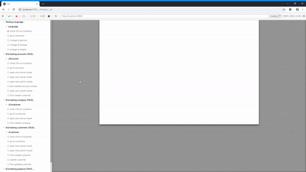

# Running tests

## Jest

To run the tests

`npm test`

To run the test, and see the coverage

`npm test -- --coverage`

## Cypress

_Prerequisites_

Write the token of the test user in ./cypress.env.json

```
{
    "REACT_APP_TEST_TOKEN" : "*****|************************"
}
```

### Run all tests

to run all the tests in the terminal

`npx cypress run`

### Run specific test

to run a specific test, and/or see the testing in action



`npx cypress open`
